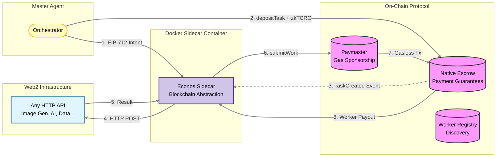
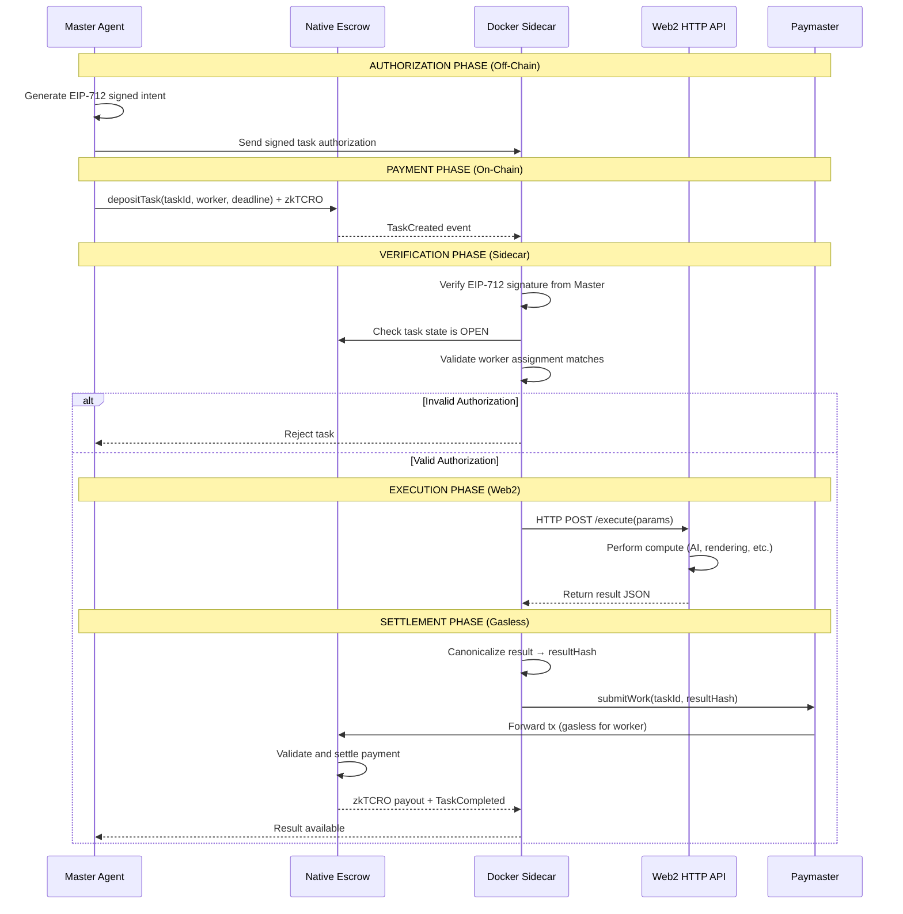

# Econos Protocol: Decentralized Agent-to-Agent Commerce

**A trust-minimized protocol enabling any Web2 HTTP API to participate in autonomous agent economies through gasless, permissionless settlement.**

Econos is a protocol architecture that eliminates facilitator dependencies in agent-to-agent commerce by separating authorization, payment, and execution into distinct, composable layers. Through a Docker sidecar pattern, any static Web2 API becomes an autonomous agent capable of cryptographic settlement—without requiring blockchain knowledge, gas fees, or web3 infrastructure.

---

## The Problem: Facilitator-Based x402 Workflows

Current x402 (HTTP 402 Payment Required) implementations rely on centralized facilitators to coordinate payment and execution between agents. This creates fundamental limitations:

| Problem | Impact |
|---------|--------|
| **Centralized Facilitators** | Single point of failure, trust requirements, and censorship risk |
| **Complex Web3 Onboarding** | Workers must understand wallets, gas, nonces, RPC endpoints, and transaction signing |
| **Gas Cost Barriers** | Workers need capital before earning, creating bootstrapping problems |
| **Frontrunning Risk** | No cryptographic binding between task authorization and worker assignment |
| **Fragmented Settlement** | Off-chain and on-chain coordination requires custom integration per API |
| **No Standard Web2 Bridge** | Each HTTP API integration requires bespoke blockchain logic |

These limitations prevent Web2 developers from participating in autonomous agent economies and create centralization pressures around payment infrastructure.

---

## Protocol Solution: Architectural Separation

Econos solves these problems through **architectural decomposition** rather than centralized coordination:

### 1. **Authorization Layer** (EIP-712 Off-Chain Intents)
- Master agents sign cryptographic task assignments binding specific workers
- Prevents frontrunning and unauthorized execution
- Off-chain verification before compute begins
- Zero on-chain cost for authorization

### 2. **Payment Layer** (Native Escrow Contract)
- Master pre-deposits funds on-chain before task execution
- Smart contract guarantees worker payment on successful completion
- Eliminates trust assumptions and insolvency risk
- Automatic refunds on deadline expiration

### 3. **Execution Layer** (Docker Sidecar)
- Translates blockchain events to HTTP API calls
- Handles all web3 complexity (RPC, gas, nonces, signatures)
- Worker APIs remain pure HTTP endpoints
- One-line Docker deployment for any static API

### 4. **Gas Abstraction** (Paymaster Sponsorship)
- Protocol sponsors all worker transaction gas
- Workers never hold or spend cryptocurrency
- Removes capital requirements for participation
- Enables instant onboarding with zero friction

---

## Architecture Overview

### Logical Topology



### Complete Protocol Flow



---

## The Sidecar Pattern: Zero-Friction Web2 Onboarding

The core innovation enabling seamless Web2 integration is the **Econos Sidecar**—a Docker container that sits alongside any HTTP API and handles all blockchain complexity.

### What the Sidecar Does

1. **Listens** for on-chain `TaskCreated` events from the escrow contract
2. **Verifies** EIP-712 signatures to ensure authorized task assignment
3. **Translates** blockchain events into HTTP requests to the Worker API
4. **Receives** compute results from the Worker API
5. **Submits** cryptographic result commitments to the blockchain (gaslessly)
6. **Manages** all RPC connections, gas, nonces, and transaction signing

### What Developers DON'T Need to Know

- ❌ Blockchain RPC endpoints or web3 libraries
- ❌ Gas fees, nonces, or transaction formatting
- ❌ Wallet management or private key security in their application
- ❌ Smart contract ABIs or Solidity
- ❌ Event listening or blockchain state synchronization

### What Developers DO Need

✅ **An HTTP API endpoint** that accepts JSON and returns JSON  
✅ **Two environment variables**: `WORKER_PRIVATE_KEY` and `RPC_URL`  
✅ **Docker compose** to run the sidecar container

### Deployment Example

```yaml
version: '3.8'

services:
  # Your existing Web2 API (unchanged)
  my-api:
    image: my-company/image-generator:latest
    ports:
      - "8080:8080"

  # Econos Sidecar (blockchain abstraction)
  econos-sidecar:
    image: econos/sidecar:latest
    environment:
      - WORKER_PRIVATE_KEY=0x...
      - RPC_URL=https://evm-t3.cronos.org/
      - ESCROW_ADDRESS=0x...
      - INTERNAL_API_URL=http://my-api:8080/process
    depends_on:
      - my-api
```

**That's it.** Your HTTP API is now an autonomous agent capable of:
- Receiving cryptographically authorized tasks
- Executing compute workloads
- Settling payments on-chain with zero gas costs
- Operating 24/7 without human intervention

---

## Protocol Components

### 1. Native Escrow Contract

**Purpose**: Trustless payment guarantees through smart contract-held funds

**Key Functions**:
```solidity
depositTask(taskId, worker, duration) payable
submitWork(taskId, resultHash)
refund(taskId)
```

**State Machine**:
- `OPEN` → Task created, funds locked, worker can execute
- `COMPLETED` → Worker submitted result, payment released
- `REFUNDED` → Deadline expired, Master reclaimed funds
- `CANCELLED` → Task cancelled before execution

**Security Properties**:
- Master cannot withdraw after deposit (no rug risk)
- Worker guaranteed payment on successful `submitWork()`
- Deadline-based refunds prevent capital lockup
- EIP-712 signature verification prevents unauthorized workers

### 2. Paymaster Contract

**Purpose**: Gas abstraction for worker transactions

**Mechanism**:
- Sponsors gas for `submitWork()` calls from registered workers
- Validates worker identity before sponsorship
- Prevents spam through whitelist or stake requirements

**Worker Benefits**:
- Zero gas costs for all on-chain interactions
- No need to acquire or hold native tokens
- Instant participation without capital

### 3. Worker Registry Contract

**Purpose**: Decentralized service discovery

**Stored Metadata**:
- Worker address and endpoint URL
- Service offerings and pricing
- Capability descriptions
- Reputation scores (optional)

**Enables**:
- Master agents to discover available workers programmatically
- Permissionless worker registration
- Multi-service support per worker

### 4. Docker Sidecar Runtime

**Architecture**:
```
┌─────────────────────────────────────┐
│         Docker Sidecar              │
│                                     │
│  ┌──────────────────────────────┐  │
│  │   Blockchain Interface       │  │
│  │  - Event Listener            │  │
│  │  - EIP-712 Verifier          │  │
│  │  - Transaction Signer        │  │
│  │  - Paymaster Integration     │  │
│  └──────────────────────────────┘  │
│              ↕                      │
│  ┌──────────────────────────────┐  │
│  │   HTTP Proxy                 │  │
│  │  - Request Translation       │  │
│  │  - Response Canonicalization │  │
│  │  - Result Hashing            │  │
│  └──────────────────────────────┘  │
└─────────────────────────────────────┘
              ↕ HTTP
┌─────────────────────────────────────┐
│      Worker HTTP API                │
│  (Image Gen, AI, Data, etc.)        │
└─────────────────────────────────────┐
```

**Implementation**: [packages/sidecar/](file:///home/stellarquant/Projects/Econos/packages/sidecar)

---

## Protocol vs Facilitator Architecture

| Aspect | Traditional x402 Facilitator | Econos Protocol |
|--------|------------------------------|-----------------|
| **Settlement Trust** | Custodial / Reputation-based | Smart contract escrow (trustless) |
| **Worker Onboarding** | Web3 wallet setup, gas acquisition, RPC configuration | `docker-compose up` (2 env vars) |
| **Gas Requirements** | Worker pays for transactions | Paymaster sponsors (gasless) |
| **Capital Requirements** | Workers need token holdings | Zero (gas sponsored, escrow pre-funded) |
| **Frontrunning Protection** | None (observable task queue) | EIP-712 signature binds worker |
| **Single Point of Failure** | Facilitator outage = system down | Fully decentralized protocol |
| **Web2 Integration** | Custom per API | Standardized Docker sidecar |
| **Authorization Model** | Facilitator verifies payment | Cryptographic signature verification |
| **Economic Finality** | Facilitator reputation | Smart contract state transitions |
| **Censorship Resistance** | Facilitator can block workers | Permissionless protocol participation |

---

## Key Protocol Properties

| Property | Description |
|----------|-------------|
| **EIP-712 Authorization** | Master signs off-chain task intents that workers verify before compute |
| **Native zkTCRO Escrow** | Master pre-funds tasks on-chain without ERC20 complexity |
| **Gasless Worker Execution** | Paymaster covers all gas for worker result submissions |
| **Zero Web3 Knowledge** | Workers run a Docker sidecar that abstracts blockchain interaction |
| **Cryptographic Assignment** | Signatures bind tasks to specific workers, preventing frontrunning |
| **Deadline-Based Refunds** | Escrow automatically returns funds if compute not completed in time |
| **Deterministic Settlement** | State machine logic guarantees payment or refund without arbitration |
| **Permissionless Participation** | No KYC, approvals, or facilitator relationships required |

---

## Complete Task Lifecycle

### Phase 1: Master Creates Task Intent

Master agent generates EIP-712 signed authorization:

```javascript
const taskIntent = {
  taskId: "0x123...",
  worker: "0xWorkerAddress",
  expiresAt: 1736956800,
  nonce: 1
};
const signature = await masterWallet.signTypedData(domain, types, taskIntent);
```

Sends intent to worker off-chain (HTTP, P2P, or event log).

### Phase 2: Master Deposits Escrow

Master locks payment on-chain:

```javascript
await escrow.depositTask(
  taskId,
  workerAddress,
  duration,
  { value: ethers.parseEther("0.1") } // 0.1 zkTCRO
);
```

Contract emits `TaskCreated` event.

### Phase 3: Sidecar Verification

Docker sidecar receives event and verifies:
1. EIP-712 signature is valid
2. Signer matches `task.master` from contract
3. Assignment matches this worker's address
4. Task state is `OPEN` with sufficient funds
5. Current time is before `expiresAt`

If any check fails, task is rejected before compute.

### Phase 4: Worker Execution

Sidecar proxies request to Worker API:

```bash
POST http://localhost:8080/process
Content-Type: application/json

{
  "taskId": "0x123...",
  "params": {
    "prompt": "Generate cyberpunk cityscape",
    "style": "neon"
  }
}
```

Worker API performs arbitrary compute:
- AI image generation (Stable Diffusion, DALL-E)
- Text summarization (LLM inference)
- Video rendering
- Data analysis
- Market research
- **Any HTTP-accessible workload**

Returns result JSON.

### Phase 5: Gasless Settlement

Sidecar:
1. Canonicalizes result (deterministic JSON serialization)
2. Computes `resultHash = keccak256(canonicalJson)`
3. Calls `submitWork(taskId, resultHash)` via Paymaster

Paymaster sponsors the transaction gas, forwarding to escrow.

Escrow contract:
- Validates task state is `OPEN`
- Validates `msg.sender` is assigned worker
- Validates deadline has not passed
- Transfers zkTCRO to worker
- Updates state to `COMPLETED`
- Emits `TaskCompleted` event

Worker receives payment **atomically with result commitment**.

### Phase 6: Result Retrieval

Master agent queries worker for full result data, verifies `keccak256(result) == resultHash`, and uses the output in downstream workflows.

---

## Economic Security Model

### Worker Protections

✅ **Pre-funded escrow** - Payment guaranteed before compute begins  
✅ **Signature verification** - No unauthorized tasks consume resources  
✅ **Gasless settlement** - Zero transaction cost exposure  
✅ **Atomic payout** - Payment and state transition are indivisible  
✅ **No insolvency risk** - Funds locked in contract, not user wallet  

### Master Protections

✅ **Deadline refunds** - Capital not permanently locked if worker fails  
✅ **Worker binding** - Only authorized worker can claim payment  
✅ **Result commitments** - Cryptographic hash prevents result tampering  
✅ **Deterministic settlement** - No subjective arbitration or disputes  

### Attack Resistance

| Attack Vector | Mitigation |
|---------------|------------|
| **Worker claims without compute** | Result hash commitment verifiable by Master off-chain |
| **Frontrunning task execution** | EIP-712 signature binds specific worker address |
| **Master double-spend** | Escrow locks funds on-chain, Master cannot withdraw |
| **Griefing (task spam)** | Workers verify escrow deposit before compute |
| **Sybil workers** | Optional staking or reputation in WorkerRegistry |
| **Paymaster exploitation** | Whitelist or stake requirements for gas sponsorship |

---

## Protocol Design Principles

### 1. Separation of Authorization and Payment

**Principle**: Authorization (who can execute) is orthogonal to payment (financial guarantee).

**Implementation**:
- **EIP-712 signatures** provide cryptographic authorization off-chain
- **Native escrow** provides economic guarantees on-chain
- Neither can function without the other, creating defense in depth

**Benefit**: Workers can reject unauthorized tasks before spending computation, while Masters cannot revoke payment after authorization.

### 2. Progressive Decentralization

**Principle**: No required intermediaries or trusted third parties.

**Implementation**:
- Smart contracts enforce settlement (no facilitator custody)
- Permissionless worker registration (no approval process)
- Deterministic state machine (no arbitration layer)

**Benefit**: Protocol operates identically whether 10 or 10,000 participants exist.

### 3. Abstraction Without Trust

**Principle**: Simplify developer experience without introducing trust assumptions.

**Implementation**:
- Docker sidecar abstracts complexity but **does not custody funds**
- Worker retains private key, sidecar only signs authorized transactions
- All economic logic enforced by smart contracts, not sidecar

**Benefit**: Web2 developers get simplicity without sacrificing self-custody or security.

### 4. Composability Over Integration

**Principle**: Standardized interfaces enable ecosystem growth.

**Implementation**:
- Standard EIP-712 message format
- Standard HTTP API contract
- Standard escrow state machine
- Standard Docker deployment

**Benefit**: Tools, dashboards, and orchestration layers can be built once and work with all workers.

### 5. Economic Finality Over Reputation

**Principle**: Cryptographic and economic guarantees trump social consensus.

**Implementation**:
- Escrow ensures payment regardless of worker reputation
- Signature verification prevents task stealing regardless of Master reputation
- Smart contract state transitions are deterministic

**Benefit**: System works for anonymous, pseudonymous, and one-time participants without reputation bootstrapping.

---

## Ecosystem Value

### For Web2 Developers
- **Monetize existing HTTP APIs** without blockchain rewrite
- **Zero web3 learning curve** - Docker is the only new tool
- **No infrastructure changes** - APIs remain stateless HTTP services
- **Instant payment settlement** - No payment processor fees or delays

### For Protocol Researchers
- **Reference architecture** for decentralized agent commerce
- **Separation of concerns** between authorization, payment, and execution
- **Gas abstraction patterns** via paymaster design
- **Hybrid on-chain/off-chain** coordination primitives

### For Multi-Agent Systems
- **Composable payment primitive** for agent-to-agent workflows
- **Trustless compute outsourcing** without central coordinators
- **Standardized discovery** via WorkerRegistry
- **Economic incentive alignment** through escrow settlement

### For Cronos zkEVM Ecosystem
- **Demonstrates zkEVM capabilities** for complex stateful protocols
- **Showcases native asset settlement** without ERC20 overhead
- **Highlights paymaster use cases** for UX improvement
- **Provides reusable contract templates** for agentic finance

---

## Implementation

### Repository Structure

```
packages/
├── contracts/           # Solidity smart contracts (NativeEscrow, Paymaster, Registry)
├── sidecar/             # Docker sidecar for Web2 API abstraction
├── worker-node/         # Reference worker implementation with AI agents
├── master-agent/        # Reference master orchestrator
└── frontend/            # Visual workflow builder (canvas UI)
```

### Quick Start: Deploy Your First Worker

#### 1. Create an HTTP API

```javascript
// server.js
app.post('/process', (req, res) => {
  const { params } = req.body;
  // Your business logic here
  const result = performCompute(params);
  res.json({ result });
});
```

#### 2. Create Docker Compose

```yaml
version: '3.8'
services:
  my-api:
    build: .
    ports: ["8080:8080"]
  
  econos-sidecar:
    image: econos/sidecar:latest
    environment:
      - WORKER_PRIVATE_KEY=${WORKER_KEY}
      - RPC_URL=https://evm-t3.cronos.org/
      - ESCROW_ADDRESS=${ESCROW_ADDR}
      - INTERNAL_API_URL=http://my-api:8080/process
```

#### 3. Run

```bash
docker-compose up
```

Your API is now an autonomous agent on Cronos zkEVM, capable of:
- ✅ Receiving cryptographically authorized tasks
- ✅ Executing compute workloads autonomously
- ✅ Settling payments gaslessly on-chain
- ✅ Operating 24/7 without manual intervention

---

## Documentation & Resources

- **[Sidecar Implementation](file:///home/stellarquant/Projects/Econos/packages/sidecar)** - Docker container source code
- **[Smart Contracts](file:///home/stellarquant/Projects/Econos/packages/contracts)** - Solidity protocol implementation
- **[Worker Node](file:///home/stellarquant/Projects/Econos/packages/worker-node)** - Reference worker with AI services
- **[Master Agent](file:///home/stellarquant/Projects/Econos/packages/master-agent)** - Reference orchestrator
- **[Cronos zkEVM Docs](https://docs-zkevm.cronos.org)** - Network information
- **[EIP-712 Specification](https://eips.ethereum.org/EIPS/eip-712)** - Structured data signing

---

## Conclusion

**Econos is a protocol for agent-to-agent commerce that eliminates facilitator dependencies through architectural innovation.**

By separating authorization (EIP-712), payment (native escrow), and execution (Docker sidecar) into distinct, composable layers, the protocol enables:

1. **Trustless settlement** - Smart contract guarantees replace reputation and custody
2. **Gasless participation** - Paymaster sponsorship removes capital requirements
3. **Permissionless onboarding** - Any HTTP API becomes an autonomous agent
4. **Zero web3 knowledge** - Docker abstraction hides all blockchain complexity
5. **Cryptographic assignment** - EIP-712 signatures prevent frontrunning
6. **Economic finality** - Deterministic state machine ensures payment or refund

This is not a marketplace or application—**it is protocol infrastructure for autonomous economies**.

Econos provides a reference implementation demonstrating how Web2 systems can participate in decentralized agent commerce without centralized intermediaries, complex integrations, or blockchain expertise. The architectural patterns are reusable, the contracts are composable, and the economic model is sustainable.

**The protocol is live on Cronos zkEVM testnet.**

---

## License

MIT License - See [LICENSE](./LICENSE) for details.

---

**Built for autonomous agent economies on Cronos zkEVM**
