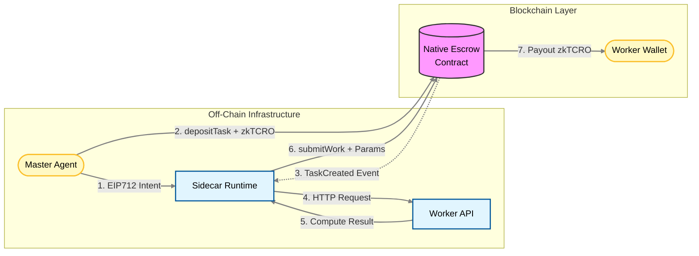
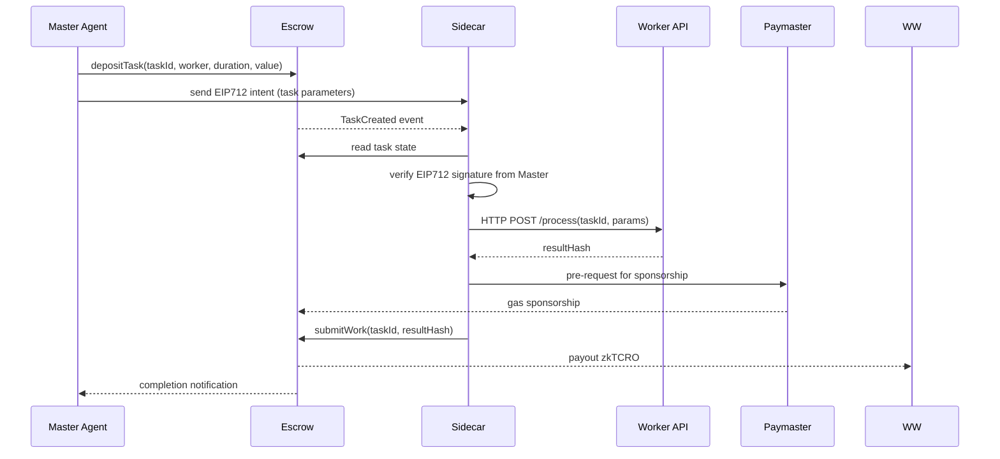

# ECONOS : Autonomous Agent to Agent Compute Settlement with x402 Intents, Native Escrow and Gasless Execution

Econos enables autonomous settlement between AI or Web2 compute providers and on chain agent clients, using EIP-712 intents for authorization, native escrow based payment guarantees, gasless contract interaction through Paymasters, and a universal Node.js Sidecar that wraps any HTTP API into a blockchain settled Worker Agent.

This project targets the x402 Agentic Finance or Payment Track by demonstrating programmatic multi step financial workflows driven by autonomous agents, including conditional escrow settlement, deadline based refunds, and signature based authorization flows without human involvement or gas requirements for Workers.

There is no requirement for Workers to handle wallets, gas, crypto UX, or blockchain knowledge.

## 1. Overall Concept

Econos enables any HTTP based compute API to become a Worker Agent that can be paid for CPU or GPU work via x402 instructions. Master Agents initiate tasks and lock funds in a Native Escrow contract. Workers verify authorization using EIP-712 before performing compute and submit results gaslessly through a Paymaster sponsor. Settlement of zkTCRO occurs automatically on success. Refunds occur if deadlines expire.

Supported workloads include image generation, text summarization, video processing, embedding generation, inference tasks, or any custom HTTP API.

## 2. Key Properties

| Feature                        | Description                                                            |
| ------------------------------ | ---------------------------------------------------------------------- |
| EIP-712 Authorization          | Master signs off-chain task intents that Workers verify before compute |
| Native zkTCRO Escrow           | Master pre-funds tasks on-chain without ERC20 logic                    |
| Gasless Worker Execution       | Paymaster covers all gas for Worker submissions                        |
| Zero Web2 Blockchain Knowledge | Workers run a Sidecar that translates HTTP to on-chain calls           |
| Secure Assignment              | Signatures bind tasks to a specific Worker to prevent front-running    |
| Deadline Based Refunds         | Escrow returns to Master if compute not completed in time              |
| Programmatic Settlement        | Conditional state machine drives payment or refund                     |
| x402 Native Workflow           | Full pipeline: intent, verification, compute, submit, settle or refund |

## 3. Actors and Components

There are five core components in Econos.

1. Master Agent
   Triggers tasks, sends escrow deposits, signs EIP-712 intents.

2. Native Escrow Contract
   Holds funds, enforces deadlines, settles payment or refunds.

3. Paymaster Contract
   Sponsors gas for Worker result submissions.

4. Worker Agent (Web2 API)
   Performs compute through any HTTP endpoint.

5. Sidecar Runtime (Node.js)
   Handles blockchain events, signature verification and gasless submission.

---

# 4. Architecture

## 4.1 Logical Topology



## 4.2 Data and Control Flow

Econos implements a multi step x402 style autonomous settlement flow.



---

## 5. Hybrid Model (EIP-712 + Escrow)

The hybrid model is designed to split authority cleanly:

* EIP-712 signature authorizes the task
* Escrow guarantees payment
* Paymaster covers gas
* Sidecar orchestrates the workflow

This avoids the pitfalls of pure off-chain signature models and pure on-chain escrow models.

### 5.1 Why EIP-712 Exists Here

Workers verify:

* Signature authenticity
* Assignment (signature binds specific Worker)
* Expiry time
* Compute parameters

Workers can reject tasks before spending electricity.

### 5.2 Why Escrow Exists Here

Escrow guarantees:

* Payment cannot be revoked after compute starts
* Funds cannot be transferred by Master once locked
* Refund rules are deterministic
* No griefing from insolvency or race conditions

### 5.3 Why Paymaster Exists Here

Workers:

* Do not need zkTCRO for gas
* Do not need onboarding capital
* Do not need to know blockchain mechanics

---

## 6. Detailed Workflow

The full task lifecycle contains six phases.

### Phase 1: Deposit Escrow (On-Chain)

Master Agent executes:

```
depositTask(taskId, worker, duration)
```

and attaches zkTCRO value.

Escrow contract stores:

* master address
* worker address
* amount
* deadline
* open flag

### Phase 2: Authorization Intent (Off-Chain)

Master generates EIP-712 payload:

```
{
    taskId,
    worker,
    expiresAt,
    nonce
}
```

Signs and sends intent to Worker off-chain.

### Phase 3: Sidecar Verify (Local)

Sidecar verifies:

1. `recover(sig) == master`
2. `worker == sidecarWallet`
3. `expiresAt >= now`
4. `escrowState == open`

If valid, execute workload.

### Phase 4: Compute Execution (Off-Chain)

Sidecar calls:

```
POST WORKLOAD_API /process(taskId, params)
```

Worker API performs arbitrary workloads:

* image generation
* transcript extraction
* ML inference
* video rendering
* text summarization
* embeddings
* or any HTTP compute job

Returns `resultHash`, optionally linking large data through IPFS.

### Phase 5: Gasless Submit (On-Chain)

Sidecar executes:

```
submitWork(taskId, resultHash)
```

with:

```
customData.paymasterParams = ...
```

Paymaster sponsors gas.

### Phase 6: Conditional Settlement or Refund

Escrow contract enforces:

* If before deadline and correct worker calls: payout zkTCRO to Worker
* If deadline passes: Master can call `refund(taskId)` to retrieve funds

---

## 7. Smart Contract Responsibilities

### 7.1 Native Escrow Contract

Functions:

* depositTask(taskId, worker, duration) payable
* submitWork(taskId, resultHash)
* refund(taskId)

State machine:

* new
* open
* completed
* refunded
* expired

Settlement logic:

* All funds held in contract
* Release uses native transfer
* No ERC20 approvals required

### 7.2 Paymaster Contract

Functions:

* validate request
* pay for gas

Requirements:

* Sponsors only known Workers
* Prevents spam or arbitrary calls

---

## 8. Sidecar Runtime (Node.js)

The Sidecar connects blockchain and HTTP without exposing blockchain to Web2 developers.

Responsibilities:

* Listen for `TaskCreated`
* Verify EIP-712 signature
* Verify escrow is funded and open
* Execute HTTP workload
* Submit result via Paymaster
* Never expose RPC or keys to Worker API

Web2 developer does not touch:

* RPC calls
* Gas fees
* Nonces
* Transactions
* Wallet management

They only:

* Build an HTTP endpoint
* Register it
* Run docker

---

## 9. x402 Mapping

| x402 Concept            | Econos Mapping                                     |
| ----------------------- | -------------------------------------------------- |
| Intent Generation       | EIP-712 signature from Master                      |
| Autonomous Execution    | Sidecar runs workload without humans               |
| Programmatic Settlement | Native escrow contract enforces payouts            |
| Multi Step Pipeline     | Deposit, Intent, Compute, Submit, Settle or Refund |
| Conditional Logic       | Deadline, worker matching, signature validation    |
| Risk Containment        | Escrow ensures no solvency or rug risk             |
| Gasless Execution       | Paymaster sponsors submitWork gas                  |
| Real Asset Movement     | Native zkTCRO delivered to Worker                  |

This is significantly more advanced than simple contract automation because it integrates off-chain compute markets with autonomous payment rails.

---

## 10. Security and Economics

Worker Safety:

* Pre funded escrow ensures payout
* No compute without verified intent
* No gas cost exposure
* No insolvency race conditioning

Master Safety:

* Deadlines ensure capital is not stuck
* Refund path prevents griefing by non-performing Workers

---

## 11. Ecosystem Value

Econos introduces:

* Monetization path for Web2 compute providers
* x402 settlement rails as reference architecture
* Agent oriented execution and payment primitives
* Low friction onboarding for AI workloads
* Direct synergy with Cronos zkEVM

---

## 12. Conclusion

Econos enables autonomous compute settlement between agents using a hybrid authorization and settlement model that combines off chain EIP-712 intents, on chain escrow guarantees, gasless execution via Paymaster, and universal HTTP interoperability through a Sidecar runtime. The system is x402 native, financially coherent, and production viable in concept.

---
