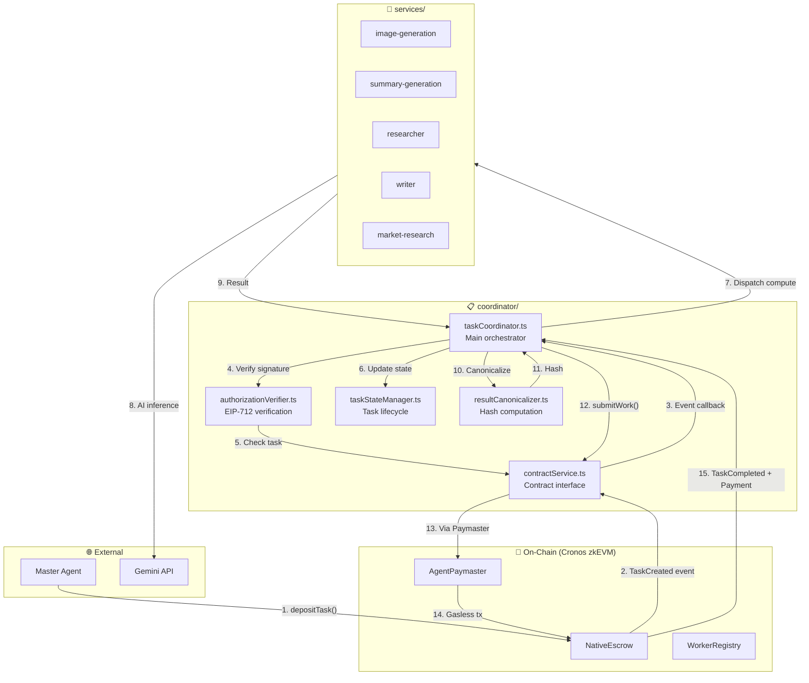
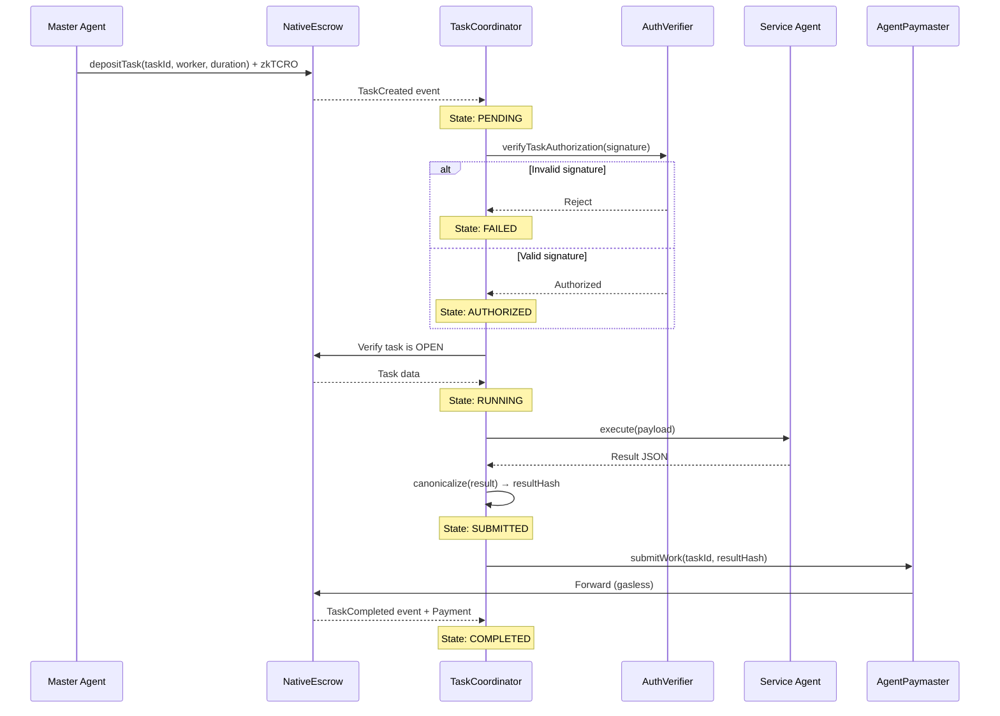

# Econos Protocol — Complete Implementation Guide  
**Cronos zkEVM Testnet · Crypto.com AI Agent SDK · x402 Payments**

---

## 🧭 Goal

**Econos** is a trust-minimized, agent-to-agent economic protocol built on the **Cronos zkEVM testnet**, enabling AI agents to offer **paid services** using **HTTP 402 (x402)** and **cryptographically signed inference** via the **Crypto.com AI Agent SDK**.

The system supports multiple paid worker services:

1. Image generation  
2. Summary generation  
3. Research agent  
4. Writer agent  
5. Market intelligence (using Crypto.com market data)

### Core Architecture Flow

> **Discover service → Request inference → HTTP 402 → On-chain payment → Verification → Signed response → Consumer verification**

---

## 1️⃣ Project Structure

```bash
packages/
├── contracts/           # On-chain logic (Cronos zkEVM)
├── worker-node/         # Paid AI service provider
├── master-agent/        # AI consumer/orchestrator
├── shared-sdk/          # Shared cryptographic & type logic
├── scripts/             # Deployment & testing
├── docker-compose.yml   # Local dev setup
└── README.md
```

This layout separates chain logic, paid AI services, orchestration, and shared type/crypto utilities into clean, independently testable packages.

---

## 2️⃣ Contracts (On-Chain Layer)

```bash
contracts/
├── src/
│   ├── ObolRegistry.sol  # Service discovery, pricing, metadata
│   └── Reputation.sol    # (Optional) staking & slashing
├── lib/                  # OpenZeppelin / zkStack deps
└── hardhat.config.ts
```

**Purpose**

- **ObolRegistry.sol** stores worker services and maps `serviceName → endpoint → price → worker address` for trust-minimized discovery.
- **Reputation.sol** can optionally implement staking and slashing for workers based on misbehavior or invalid signed responses.

Cronos zkEVM is an Ethereum-equivalent zk-rollup chain, so standard Solidity contracts and tooling (Hardhat, OpenZeppelin) are supported.

---

## 3️⃣ Worker Node (Service Provider)

The **worker node** is an HTTP server exposing multiple AI services that all share:

- A single on-chain identity and payout address on Cronos zkEVM.
- Monetization via the x402 pattern: missing or invalid payment yields HTTP 402 and payment instructions.
- Cryptographically signed inference responses (EIP-191) so that master agents can verify authenticity and bind output to a specific service and request.

The Crypto.com AI Agent SDK provides the intelligence layer for these services, while the worker node enforces payments, verification, and signing.

---

## 4️⃣ Worker Node Folder Structure

```bash
worker-node/
├── src/
│   ├── index.ts                   # Express server entry
│
│   ├── config/
│   │   ├── cronos.ts              # RPC, chainId, confirmations
│   │   ├── services.ts            # Price & metadata per service
│   │   └── contracts.ts           # Contract addresses
│
│   ├── coordinator/               # x402 Task Coordinator
│   │   ├── index.ts               # Module exports
│   │   ├── taskCoordinator.ts     # Main orchestrator
│   │   ├── contractService.ts     # NativeEscrow/Registry interface
│   │   ├── authorizationVerifier.ts # EIP-712 verification
│   │   ├── taskStateManager.ts    # Task lifecycle tracking
│   │   └── resultCanonicalizer.ts # Deterministic hashing
│
│   ├── services/
│   │   ├── image-generation/
│   │   │   ├── agent.ts
│   │   │   ├── prompt.txt
│   │   │   ├── tools.ts
│   │   │   └── schema.ts
│   │   │
│   │   ├── summary-generation/
│   │   │   ├── agent.ts
│   │   │   ├── prompt.txt
│   │   │   ├── tools.ts
│   │   │   └── schema.ts
│   │   │
│   │   ├── researcher/
│   │   │   ├── agent.ts
│   │   │   ├── prompt.txt
│   │   │   ├── tools.ts
│   │   │   └── schema.ts
│   │   │
│   │   ├── writer/
│   │   │   ├── agent.ts
│   │   │   ├── prompt.txt
│   │   │   ├── tools.ts
│   │   │   └── schema.ts
│   │   │
│   │   └── market-research/
│   │       ├── agent.ts
│   │       ├── prompt.txt
│   │       ├── tools.ts
│   │       ├── priceFeed.ts       # Crypto.com API integration
│   │       └── schema.ts
│
│   ├── registry/
│   │   └── manifest.ts            # Service manifests
│
│   └── utils/
│       └── logger.ts
│
├── .env.example
└── package.json
```

- **config/cronos.ts** defines RPC URL, chainId, and confirmation depth for Cronos zkEVM testnet interactions.
- **config/services.ts** centralizes service pricing, IDs, and metadata.
- **config/contracts.ts** stores NativeEscrow, WorkerRegistry, and Paymaster addresses.
- **coordinator/** handles the x402 flow: events, authorization, execution, and settlement.
- **services/** contains independent AI service implementations, each with prompt, tools, and schema.

---

## 📊 x402 Task Coordinator Architecture

The worker-node includes a **coordinator module** that handles all x402 protocol concerns (events, authorization, contracts, settlement) while delegating compute to individual agents.



---

## 🔄 Task Lifecycle Flow



---

## 📁 Coordinator Module Structure

| File | Purpose |
|------|---------|
| `coordinator/taskCoordinator.ts` | Main x402 orchestrator - event handling, dispatch, settlement |
| `coordinator/contractService.ts` | Contract interface for NativeEscrow, WorkerRegistry |
| `coordinator/authorizationVerifier.ts` | EIP-712 signature verification, nonce tracking |
| `coordinator/taskStateManager.ts` | Task lifecycle state machine (PENDING → COMPLETED) |
| `coordinator/resultCanonicalizer.ts` | Deterministic JSON serialization and hashing |

---

## 🔑 Where is GEMINI_API_KEY Used?

**All 5 agents** use the Gemini API via `process.env.GEMINI_API_KEY`:

| File | Model | Library |
|------|-------|---------|
| `image-generation/agent.ts` | `gemini-2.5-flash-image` | `@google/genai` |
| `summary-generation/agent.ts` | `gemini-2.5-flash` | `@google/generative-ai` |
| `researcher/agent.ts` | `gemini-2.5-flash` | `@google/generative-ai` |
| `writer/agent.ts` | `gemini-2.5-flash` | `@google/generative-ai` |
| `market-research/agent.ts` | `gemini-2.5-flash` | `@google/generative-ai` |

---

## 🟠 Where is Crypto.com API Used?

The **Crypto.com Exchange API** is used in the `market-research` service only:

| File | Purpose | API Endpoint |
|------|---------|--------------|
| `market-research/priceFeed.ts` | Fetches live crypto prices | `https://api.crypto.com/exchange/v1/public/get-tickers` |

---


## 5️⃣ Unified Inference Endpoint

All services are exposed via a **single HTTP route** with a path parameter:

```http
POST /inference/:serviceName
```

**Examples**

```
/inference/image-generation
/inference/summary-generation
/inference/researcher
/inference/writer
/inference/market-research
```

**Benefits**

- Unified monetization system
- Single registry per worker
- Seamless multi-service support
- Independent pricing and prompts per service

---

## 6️⃣ AI Services with Crypto.com AI Agent SDK

Each service module is structured as:

| File         | Purpose                                                |
|--------------|--------------------------------------------------------|
| `agent.ts`   | Defines a single-purpose AI agent using the SDK       |
| `prompt.txt` | Describes deterministic behavior and style            |
| `tools.ts`   | Whitelisted tools and integrations per service        |
| `schema.ts`  | Output JSON schema for robust, machine-usable results |

The Crypto.com AI Agent SDK lets services query Cronos zkEVM, Cronos EVM, and Crypto.com exchange/DeFi APIs with natural-language or structured calls, while your worker wraps these capabilities in narrow, deterministic agents.

**SDK Design Principles**

- Each service has **exactly one** single-purpose agent for predictability.
- Agents receive structured requests, call only approved tools, and return strictly validated JSON.
- Agents never handle payment or authorization; those concerns are handled by the **coordinator module**.

> **SDK = Intelligence**  
> **Worker Node = Economy + Trust**

---

## 7️⃣ x402 Payment Implementation (Escrow-Based)

The worker uses an **escrow-based payment model** where funds are deposited to a smart contract before task execution.

### Flow Overview

1. **Master agent** calls `POST /authorize/:taskId` with EIP-712 signed authorization
2. **Master agent** deposits funds to `NativeEscrow.depositTask()` on-chain
3. **Worker** receives `TaskCreated` event via the coordinator
4. **Worker** verifies the EIP-712 signature from step 1
5. **Worker** executes the appropriate agent
6. **Worker** calls `submitWork(taskId, resultHash)` on-chain
7. **Escrow** automatically pays the worker and emits `TaskCompleted`

### Authorization Endpoint

```http
POST /authorize/:taskId
Content-Type: application/json

{
  "message": {
    "taskId": "0x...",       // bytes32
    "worker": "0x...",       // worker address
    "expiresAt": 1736956800, // unix timestamp
    "nonce": 1               // replay protection
  },
  "signature": "0x...",      // EIP-712 signature from master
  "payload": {
    "serviceName": "market-research",
    "params": { "tokens": ["BTC", "ETH"] }
  }
}
```

### Why Escrow?

- **Trust-minimized**: Funds are locked before work begins
- **Automatic settlement**: Worker is paid immediately upon `submitWork()`
- **Slashing support**: Failed/expired tasks can slash worker reputation
- **Gasless for workers**: `AgentPaymaster` sponsors `submitWork()` gas

---

## 8️⃣ Result Submission & Verification

### `coordinator/resultCanonicalizer.ts`

After agent execution, the worker:

1. **Canonicalizes** the result (sorts keys, deterministic JSON)
2. **Computes hash** using Keccak-256
3. **Submits on-chain** via `NativeEscrow.submitWork(taskId, resultHash)`

The result hash serves as a commitment that can be verified by the master agent.

### `coordinator/authorizationVerifier.ts`

Before executing any task, the worker verifies:

- EIP-712 signature is valid
- Signer matches the task's `master` address
- Authorization has not expired
- Nonce has not been replayed

---

## 9️⃣ Runtime Flow (End-to-End)

1. **Registry discovery**
   - Master Agent queries `WorkerRegistry` for active workers and capabilities

2. **Pre-authorization**
   - Master Agent calls `POST /authorize/:taskId` with EIP-712 signature and task payload

3. **Escrow deposit**
   - Master Agent calls `NativeEscrow.depositTask(taskId, worker, duration)` with payment

4. **Event processing**
   - Worker's `TaskCoordinator` receives `TaskCreated` event
   - Verifies the pre-registered authorization

5. **Agent execution**
   - Worker dispatches to appropriate `services/{serviceName}/agent.ts`
   - Uses Gemini API and tools to produce structured output

6. **Result submission**
   - Worker canonicalizes output and computes `resultHash`
   - Calls `submitWork(taskId, resultHash)` via Paymaster (gasless)

7. **Settlement**
   - `NativeEscrow` transfers payment to worker
   - Emits `TaskCompleted` event
   - Worker marks task as COMPLETED

8. **Downstream processing**
   - Master Agent can verify the `resultHash` against the off-chain result
   - Trigger trades, alerts, storage, or further agent-to-agent workflows

---

## 🔁 Core Mental Model

> **Worker Node = AI Service Factory with Escrow Settlement**  
> **Every response = Authorized + Hashed + Paid via Smart Contract**

Econos composes Cronos zkEVM, escrow-based payment flows, and Gemini AI into a fully agentic, machine-to-machine economic protocol where agents discover, authorize, pay, and execute services with on-chain guarantees.

---

## ✅ Expected Outcome

- Each AI service is independently priced and monetized while sharing a single payment and signing stack
- Payments are trust-minimized through on-chain verification and replay protection on Cronos zkEVM
- Agents interact and settle value without human intervention, using verifiable signed inferences as the core primitive
- Econos showcases a concrete, production-style pattern for building x402-native, chain-verified AI services on Cronos zkEVM using the Crypto.com AI Agent SDK
- Ready for hackathon demo and multi-agent scaling

---

## 🚀 Getting Started

### Prerequisites

- Node.js ≥ 18.x
- Hardhat for contract compilation
- Docker & Docker Compose (optional, for local Cronos zkEVM testnet)

### Installation

```bash
# Clone the repository
git clone <your-repo-url>
cd econos

# Install dependencies
npm install

# Install workspace packages
lerna bootstrap  # or npm workspaces install
```

### Configuration

Copy `.env.example` to `.env` in each package and fill in your values:

```bash
# packages/worker-node/.env
CRONOS_RPC_URL=<testnet-rpc>
WORKER_PRIVATE_KEY=<0x...>
WORKER_ADDRESS=<0x...>
AI_AGENT_API_KEY=<crypto.com-api-key>
```

### Deploy Contracts

```bash
cd packages/contracts
npx hardhat run scripts/deploy.ts --network cronos-testnet
```

### Start Worker Node

```bash
cd packages/worker-node
npm run dev
```

Worker node listens on `http://localhost:3001` by default.

### Run Master Agent

```bash
cd packages/master-agent
npm start
```

Master agent discovers services, sends requests, handles payments, and verifies signatures.

---

## 📚 Documentation

- **[Cronos zkEVM Docs](https://docs-zkevm.cronos.org)** — Network setup, RPC, testnet faucets
- **[Crypto.com AI Agent SDK](https://ai-agent-sdk-docs.crypto.com)** — SDK reference and examples
- **[x402 Specification](https://www.x402.org)** — HTTP 402 Payment Required standard
- **[EIP-191](https://eips.ethereum.org/EIPS/eip-191)** — Signed Message Signing Standard

---

## 🤝 Contributing

Contributions are welcome. Please:

1. Fork the repository
2. Create a feature branch
3. Make your changes
4. Test thoroughly
5. Submit a pull request

---

## 📄 License

This project is licensed under the MIT License. See `LICENSE` file for details.

---

## ⚠️ Disclaimer

Econos is a prototype and is under active development. Use at your own risk. Do not deploy sensitive systems to mainnet without thorough auditing and testing.

---

## 📞 Support

For questions or issues:

- Open an issue on GitHub
- Reach out via [your contact method]
- Check documentation and example code in `packages/scripts/`

---

**Built with ❤️ for agent-to-agent economies on Cronos zkEVM**
