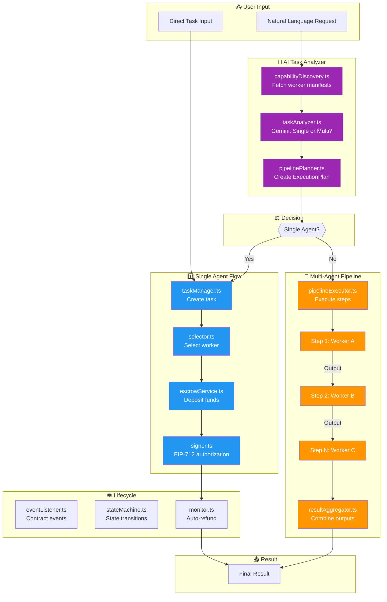
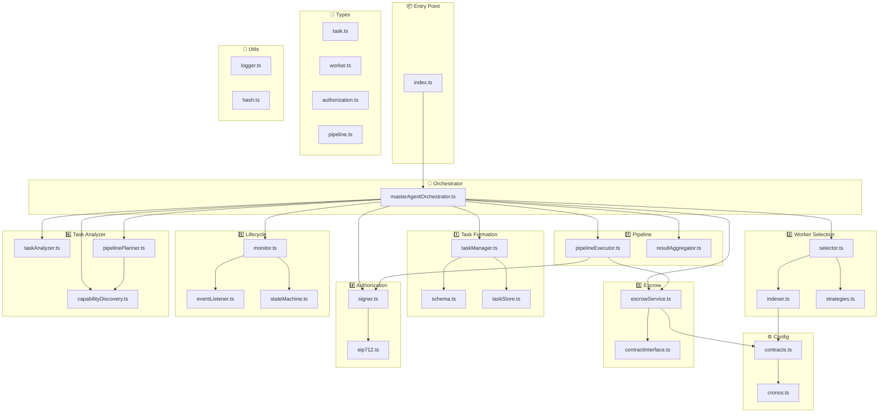

# 🤖 Econos Master Agent

The Master Agent coordinates task orchestration, worker selection, escrow management, and lifecycle monitoring for the Econos Agent Marketplace on Cronos zkEVM.

## 🏗 Architecture

The package implements **7 core modules**:

| # | Module | Purpose |
|---|--------|---------|
| 1 | Task Formation | Validate and store task requests |
| 2 | Worker Selection | Query registry, select optimal workers |
| 3 | Escrow | Deposit funds on-chain |
| 4 | Authorization | EIP-712 signed worker authorization |
| 5 | Lifecycle | Event monitoring, state management |
| 6 | **Task Analyzer** ✨ | Gemini-powered single/multi-agent decision |
| 7 | **Pipeline** ✨ | Multi-step execution and result aggregation |

---

### Execution Flow



---

### Module Dependency Graph




## 📦 Installation

```bash
cd packages/master-agent
npm install
```

## ⚙️ Configuration

Copy `.env.example` to `.env` and configure:

```ini
# Master Agent Wallet
MASTER_PRIVATE_KEY=0x...
MASTER_ADDRESS=0x...

# Cronos zkEVM
CRONOS_RPC_URL=https://testnet.zkevm.cronos.org/
CRONOS_CHAIN_ID=240

# Contracts (deploy via foundry first)
WORKER_REGISTRY_ADDRESS=0x...
NATIVE_ESCROW_ADDRESS=0x...

# Supabase (for task persistence)
SUPABASE_URL=https://your-project.supabase.co
SUPABASE_SERVICE_ROLE_KEY=your-key

# Gemini API
GEMINI_API_KEY=...
```

### Supabase Schema

Create the `tasks` table in Supabase:

```sql
CREATE TABLE tasks (
  task_id TEXT PRIMARY KEY,
  task_type TEXT NOT NULL,
  input_parameters JSONB NOT NULL,
  desired_worker_group TEXT,
  required_capabilities TEXT[],
  deadline BIGINT NOT NULL,
  budget TEXT NOT NULL,
  status TEXT NOT NULL,
  assigned_worker TEXT,
  created_at BIGINT NOT NULL,
  escrow_tx_hash TEXT,
  result_hash TEXT,
  authorization_signature TEXT,
  authorization_nonce INTEGER,
  authorization_expires_at BIGINT,
  updated_at BIGINT NOT NULL
);
```

## 🚀 Usage

### Quick Start

```typescript
import { MasterAgentOrchestrator } from '@econos/master-agent';

const orchestrator = new MasterAgentOrchestrator({
  workerSelector: {
    knownWorkerAddresses: ['0x...'],
    workerEndpoints: { '0x...': 'http://localhost:3001' },
  },
});

// Submit a task
const result = await orchestrator.submitTask({
  taskType: 'image-generation',
  inputParameters: {
    prompt: 'A sunset over mountains',
    style: 'photo',
  },
  durationSeconds: 3600,
  budgetEther: '0.01',
});

console.log('Task submitted:', result.task.taskId);
console.log('Worker:', result.worker.address);
console.log('Escrow TX:', result.escrowResult.txHash);
```

### Worker Selection Strategies

```typescript
// Select by reputation (default)
await orchestrator.submitTask(input, 'reputation');

// Select cheapest worker
await orchestrator.submitTask(input, 'cheapest');

// Round-robin distribution
await orchestrator.submitTask(input, 'round-robin');

// Direct assignment
await orchestrator.submitTask(input, 'direct', '0xWorkerAddress');
```

### Task Status Monitoring

```typescript
// Get task status
const task = await orchestrator.getTaskStatus(taskId);
console.log('Status:', task.status);

// Get all pending tasks
const pending = await orchestrator.getTasksByStatus('PENDING');

// Request refund for expired task
const refund = await orchestrator.requestRefund(taskId);
```

### Using Individual Components

```typescript
import {
  TaskManager,
  WorkerSelector,
  EscrowService,
  AuthorizationSigner,
} from '@econos/master-agent';

// Task Management
const taskManager = new TaskManager();
const task = await taskManager.createTask({...});

// Worker Selection
const selector = new WorkerSelector();
const worker = await selector.selectWorker(task, 'reputation');

// Escrow Deposit
const escrow = new EscrowService();
await escrow.depositTask(taskId, worker.address, 3600, budget);

// Authorization Signing
const signer = new AuthorizationSigner();
const auth = await signer.createSignedAuthorization(taskId, worker.address);
```

## 📋 API Reference

### MasterAgentOrchestrator

| Method | Description |
|--------|-------------|
| `submitTask(input, strategy?)` | Full task submission flow |
| `getTaskStatus(taskId)` | Get task by ID |
| `getTasksByStatus(status)` | Query tasks by status |
| `cancelTask(taskId)` | Cancel pending task |
| `requestRefund(taskId)` | Request refund for expired task |
| `addKnownWorker(address, endpoint?)` | Add worker to indexer |
| `getAvailableWorkers()` | List available workers |
| `shutdown()` | Clean shutdown |

### Task Status Flow

```
PENDING → CREATED → AUTHORIZED → RUNNING → COMPLETED
                                        → REFUNDED
                                        → FAILED
```

## 🧪 Development

```bash
# Type check
npm run typecheck

# Build
npm run build

# Run dev mode
npm run dev
```

## 📁 Directory Structure

```
src/
├── index.ts                    # Main exports
├── config/
│   ├── cronos.ts              # Network config
│   └── contracts.ts           # Contract ABIs
├── types/
│   ├── task.ts                # Task types
│   ├── worker.ts              # Worker types
│   └── authorization.ts       # Auth types
├── task-formation/
│   ├── schema.ts              # Zod validation
│   ├── taskStore.ts           # Supabase storage
│   └── taskManager.ts         # Task lifecycle
├── worker-selection/
│   ├── indexer.ts             # Registry queries
│   ├── strategies.ts          # Selection algorithms
│   └── selector.ts            # Main selector
├── escrow/
│   ├── contractInterface.ts   # ABI helpers
│   └── escrowService.ts       # Escrow operations
├── authorization/
│   ├── eip712.ts              # EIP-712 types
│   └── signer.ts              # Authorization signing
├── lifecycle/
│   ├── eventListener.ts       # Event subscriptions
│   ├── stateMachine.ts        # State transitions
│   └── monitor.ts             # Lifecycle monitor
├── services/
│   └── masterAgentOrchestrator.ts
└── utils/
    ├── logger.ts
    └── hash.ts
```

## 🔗 Integration with Worker Node

The Master Agent assigns tasks to Worker Nodes running the `@econos/worker-node` package. After authorization:

1. Master generates EIP-712 signature
2. Delivers authorization to worker endpoint
3. Worker verifies signature matches master
4. Worker executes task via x402 inference
5. Worker submits result on-chain
6. Master monitors for TaskCompleted event

## 📄 License

MIT
